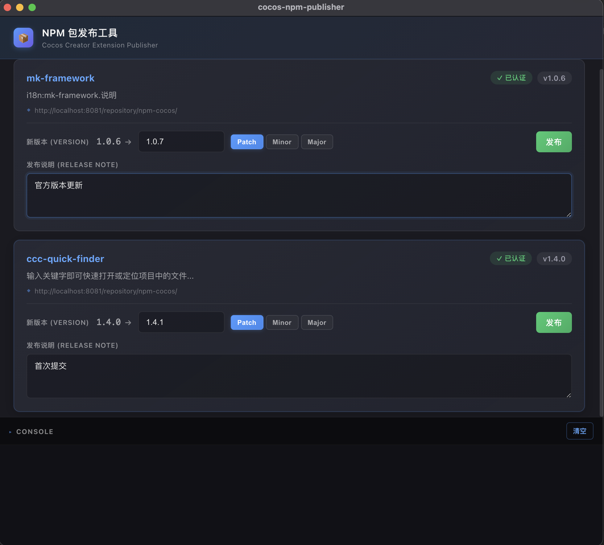

# cocos-npm-publisher

**中文** | [English](./README.en.md)

Cocos Creator 扩展插件发布管理器 —— 自动扫描项目中的扩展包，基于每个扩展目录的 `.npmrc` 选择 registry 并执行 `npm publish`。

## 功能特性

- **自动扫描扩展**：自动扫描项目 `extensions/` 目录下所有包含 `.npmrc` 和 `package.json` 的扩展包
- **版本管理**：支持 Patch / Minor / Major 语义化版本号一键升版
- **发布说明**：支持在发布前编写 Release Note，自动写入 `package.json` 的 `releaseNote` 字段
- **NPM 登录**：当扩展的 `.npmrc` 中未检测到认证信息时，提供用户名/密码登录功能，自动写入 auth 配置
- **npmrc 规范化**：发布前自动修正 `.npmrc` 中的 `always-auth` 配置，兼容 npm v9+
- **失败回滚**：发布失败时自动回滚 `package.json` 到发布前的状态
- **实时日志**：面板底部内置 Console 区域，实时输出发布过程中的日志



## 使用前提

每个需要发布的扩展目录下必须包含：

1. **`package.json`** —— 标准的 npm 包描述文件
2. **`.npmrc`** —— 必须包含 `registry=<你的 npm registry 地址>`，插件据此确定发布目标

```
extensions/
├── my-extension-a/
│   ├── package.json
│   └── .npmrc          ← registry=https://registry.npmjs.org/
├── my-extension-b/
│   ├── package.json
│   └── .npmrc          ← registry=https://your-private-registry.com/
```

## 安装

将 `cocos-npm-publisher` 目录放置到 Cocos Creator 项目的 `extensions/` 目录下即可。

## 使用方式

1. 在 Cocos Creator 菜单栏中点击 **扩展 → NPM 扩展包管理器 → 打开发布面板**
2. 插件会自动扫描 `extensions/` 下的可发布扩展，以卡片形式展示
3. 每张卡片显示扩展名称、当前版本、描述、registry 地址及认证状态
4. 选择版本升级类型（Patch / Minor / Major），或手动输入目标版本号
5. 填写发布说明（可选）
6. 如果未认证，先通过登录表单输入用户名和密码完成认证
7. 点击 **发布** 按钮，插件将自动更新 `package.json` 并执行 `npm publish --access public`


## 许可证

本项目基于 [MIT License](./LICENSE) 开源。
